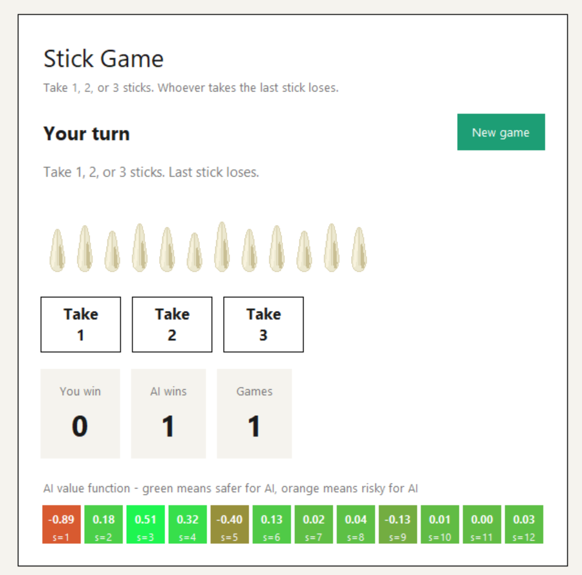
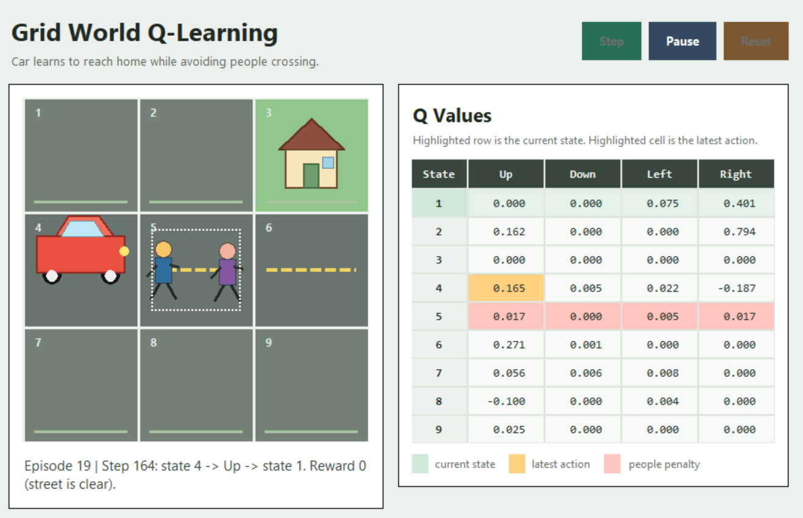

# RL Games

Small reinforcement-learning examples with:
- a console version in `sticks.py`
- a Tkinter GUI in `sticks_gui.py`
- a Grid World Q-learning console demo in `grid_world_q_learning.py`
- an interactive Grid World visualizer in `grid_world_gui.py`
- a car-themed Q-learning game in `car_game_Q_learning.py`
- a car-themed Q-learning GUI in `car_game_Q_learning_gui.py`

## Stick Game Rules

- Start with `12` sticks.
- Each turn, a player takes `1`, `2`, or `3` sticks.
- The player who takes the last stick loses.

## Files

- `sticks.py`: game logic, training, and console mode
- `sticks_gui.py`: graphical interface built on top of `sticks.py`
- `grid_world_q_learning.py`: 3x3 Q-learning environment and console training loop
- `grid_world_gui.py`: Tkinter interface for stepping through Grid World Q-learning
- `car_game_Q_learning.py`: car-themed Q-learning environment where the agent learns a route home
- `car_game_Q_learning_gui.py`: animated Tkinter GUI for the car Q-learning game

## Run

### Stick Game Console Mode

```powershell
python .\sticks.py
```

- Press `P` at startup to play as the human.
- Press `Enter` to run the automated evaluation.
- During a human game, type `Q` to quit.

### Stick Game GUI Mode

```powershell
python .\sticks_gui.py
```
### Car Game Console Mode

```powershell
python .\car_game_Q_learning.py
```

### Car Game GUI Mode

```powershell
python .\car_game_Q_learning_gui.py
```

Use `Step` to watch one Q-learning update, `Auto` to run animated training, and `Reset` to restart learning.

## Stick Game Features

- trained agent based on a simple value-function approach
- human vs AI mode
- automated evaluation mode
- game-level and move-level statistics
- Tkinter interface with visual sticks and score tracking

## Demo


## Grid World GUI Features

- animated car agent instead of the console `X`
- animated people crossing the center street cell
- home target drawn on the goal cell
- live Q-value table updated after every action
- current state and latest action highlighting

## Car Game Description

The car game is a small 3x3 Q-learning environment. The car starts from the bottom-left cell, tries to reach home in the top-right cell, and receives a penalty when it drives into the cell where people are crossing the street.

The GUI visualizes the learning process with an animated car, animated people, a home target, episode progress, and a Q-value table that updates after every action. Auto training stops after 40 episodes.

## Car Game Demo



